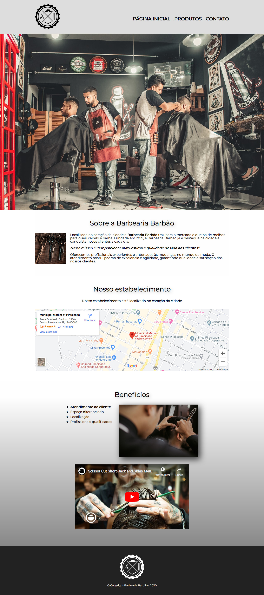

# Barbearia

> Projeto para estudos de HTML e CSS

## Créditos

* Imagem `banner.jpg` por [**Thgusstavo** em **Prexels**](https://www.pexels.com/photo/men-having-their-haircut-1813272/)
* Imagem `beneficios.jpg` por [**Luis Quintero** em **Pexels**](https://www.pexels.com/photo/selective-focus-photography-of-a-barber-1453005/)
* Imagem `logo.png` por [**PNGFuel**](https://www.pngfuel.com/free-png/oxuug)
* Imagem `barba.jpg` por [**Nick Demou** em **Pexels**](https://www.pexels.com/photo/person-holding-gray-straight-razor-1319461/)
* Imagem `cabelo.jpg` por [**Dmitry Zvolskiy** em **Pexels**](https://www.pexels.com/photo/person-combing-person-s-hair-1570807/)
* Imagem `barbacabelo.jpg` por [**cottonbro** em **Pexels**](https://www.pexels.com/photo/man-in-white-and-black-stripe-shirt-holding-black-pen-3998429/)
* Imagem `utensilios.jpg` por [**Nick Demou** em **Pexels**](https://www.pexels.com/photo/several-scissors-1319460/)

## Imagem

